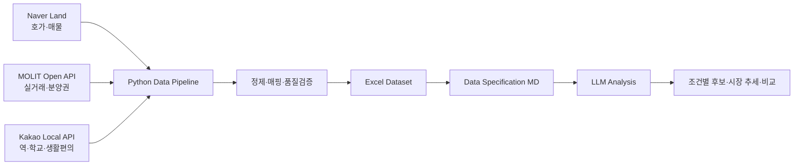

# Daegu Apartment Decision Data Pipeline

**LLM이 접근하기 어려운 외부 데이터를 직접 수집·정제·구조화하고, LLM의 분석 능력과 연결한 개인 데이터 엔지니어링 프로젝트**

## Why I Built This

대구에서 실제 거주할 아파트를 매수하기 위해 네이버 부동산, 호갱노노 등 여러 서비스를 직접 오가며 후보 단지를 찾았습니다. 하지만 지역·예산·평형·역세권 같은 조건을 바꿀 때마다 처음부터 다시 검색하고 비교해야 해 시간이 많이 들었습니다.

처음에는 LLM에게 조건만 알려주고 네이버 부동산이나 호갱노노의 최신 데이터를 이용해 후보를 추려달라고 하고 싶었습니다. 그러나 서비스의 접근 제한 때문에 LLM이 매물·호가·실거래 데이터를 안정적으로 가져오기 어려웠습니다.

그래서 문제를 다음과 같이 바꿨습니다.

> **LLM에게 데이터를 찾게 하지 말고, 내가 정확한 분석용 데이터를 만들어 제공하자.**

네이버 부동산의 호가·매물, 국토교통부의 실거래가, 카카오 Local API의 위치 정보를 Python으로 수집·정제·결합해 Excel 데이터셋으로 만들고, 컬럼 의미와 분석 시 주의사항을 설명한 Markdown 명세와 함께 LLM에 제공합니다.

복잡한 추천 알고리즘이나 세부 분석 지표를 계속 직접 개발하는 것은 시간 대비 효율이 낮다고 판단했습니다. 대신 **데이터 엔지니어링 영역인 수집·정합성·품질·자동화에 집중하고, 조건 해석·필터링·비교·설명은 LLM의 데이터 활용 능력을 적극 활용**했습니다.

## End-to-End Flow

## What the Pipeline Produces

GUI에서 대구 8개 구, 데이터 소스, 실거래 기간을 선택하고 실행하면 지역별 파일과 대구 통합 Excel을 생성합니다.

2026-10-01 대구 8개 구 통합 실행 결과:

| Dataset | Rows |
|---|---:|
| 단지×평형 요약 | 4,370 |
| 개별 매물 | 45,918 |
| 아파트 실거래 | 22,859 |
| 분양권 실거래 | 1,928 |

Excel에는 호가뿐 아니라 세대수·건축연월·실거래·지하철·학교·생활편의시설·회전률 등 후보 비교에 필요한 데이터를 동일한 기준으로 결합합니다.

## Engineering Highlights

### 1. Silent Data Loss 발견 및 수집 구조 재설계

초기 bbox + `single-markers` 방식은 단지 밀집 지역에서 반환 한도 때문에 일부 단지가 오류 없이 누락되었습니다.

- bbox → `cortarNo` 기반으로 개선
- 법정동 대표점 방식의 커버리지 문제 재발견
- 공식 행정 계층을 이용해 법정동 목록 재구성
- 최종적으로 `regions/complexes` 기반의 동 단위 전체 단지 수집 구조로 전환

검증 과정에서 **남구 145/150 → 150/150**으로 누락을 해소했습니다.

### 2. 429 / Browser Context 문제 해결

속도 개선을 위해 Playwright APIRequestContext에서 직접 API를 호출했지만 즉시 429가 발생했습니다. 브라우저에서 자연스럽게 발생하는 요청과 직접 요청의 차이를 확인한 뒤, **브라우저 페이지 컨텍스트 내부 fetch** 방식으로 변경하여 세션 특성을 유지하면서 페이지네이션 데이터를 수집했습니다.

### 3. 운영성과 성능 개선

- 불필요한 이미지·미디어·폰트 요청 차단
- 위치 조회 캐시
- 2개 구 동시 실행
- 매물 페이지네이션 완전 수집
- 거래 해제 건 제외
- 단지명/식별자 정규화 및 매핑
- 행정구역 및 데이터 정합성 검증
- GUI 실시간 로그와 실행 상태 제공

문제 발견 → 가설 → 테스트 → 수정 → 검증 과정은 [WORKLOG](daegu_apt/WORKLOG.md)에 기록했습니다.

## LLM as the Analysis Layer

이 프로젝트에서 LLM은 데이터 수집을 대신하는 도구가 아니라 **구조화된 데이터 위에서 동적으로 분석하는 레이어**입니다.

Excel과 데이터 명세 Markdown을 함께 제공하면 LLM이 먼저 사용자의 예산·지역·평형·역세권 등 조건을 확인한 후:

- 조건에 맞는 후보 단지 추출
- 지역별 가격 흐름 비교
- 호가와 실거래를 함께 고려한 후보 설명
- 조건 변경 시 즉시 재분석

을 수행하도록 구성했습니다.

이 방식으로 분석 지표와 추천 로직을 일일이 코드에 고정하는 대신, **데이터 품질은 파이프라인이 책임지고 다양한 질의와 해석은 LLM이 담당하도록 역할을 분리**했습니다.

## Tech Stack

`Python` `Pandas` `Playwright` `Requests` `OpenPyXL` `Shapely` `Tkinter` `REST API` `Excel`

## AI-assisted Development

Claude를 코딩 보조 도구로 적극 활용했습니다. 프로젝트의 문제 정의, 필요한 데이터, 기능 요구사항, 오류 재현 조건, 검증 기준과 개선 방향은 직접 정의하고 결과를 반복 검증했습니다.

[상세 포트폴리오](PORTFOLIO.md) · [실행/출력 문서](daegu_apt/README.md) · [문제 해결 로그](daegu_apt/WORKLOG.md)
