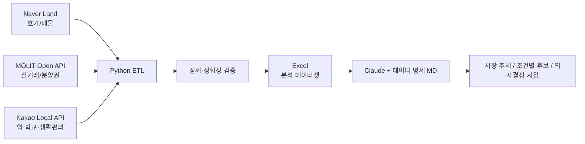

# Daegu Apt Data Pipeline

대구에서 실제 거주할 아파트를 매수하기 위해 시작한 개인 데이터 엔지니어링 프로젝트입니다.

호가·실거래가·역세권·학군·생활편의 정보가 여러 서비스에 흩어져 있어 매번 수작업으로 비교해야 했습니다. 이를 해결하기 위해 **네이버 부동산 + 국토교통부 공공데이터 + 카카오 Local API**를 하나의 파이프라인으로 연결하고, GUI에서 실행하면 분석용 Excel이 자동 생성되도록 만들었습니다.

> **핵심 목표**: 데이터를 모으는 데서 끝나지 않고, 실제 의사결정까지 이어지는 반복 가능한 데이터 흐름을 만드는 것

## Demo

GUI에서 대구 8개 구 다중 선택, 호가/실거래/통합 수집, 최근 N개월 범위, API Key, 저장 경로를 설정하고 실시간 로그를 확인할 수 있습니다.

2026-10-01 대구 8개 구 통합 실행 결과:

| 데이터셋 | 행 수 |
|---|---:|
| 단지×평형 요약 | 4,370 |
| 개별 매물 | 45,918 |
| 아파트 실거래 | 22,859 |
| 분양권 실거래 | 1,928 |

생성된 Excel과 데이터 명세 Markdown을 Claude에 전달하면 사용자의 예산·지역·평형·역세권 조건을 확인한 뒤 데이터를 필터링하고 결과를 설명하도록 구성했습니다.

## Architecture



## Engineering Highlights

### 1. 누락 없는 단지 수집

초기 bbox + `single-markers` 방식은 단지 밀집 지역에서 일부 단지가 조용히 누락되는 문제가 있었습니다.

- bbox → `cortarNo` 기반으로 개선
- 법정동 대표점만으로는 넓은 동을 커버하지 못하는 문제 재발견
- 공식 행정 계층을 사용해 대구 법정동 목록을 재구성
- 현재는 `regions/complexes`를 이용해 법정동 단위 전체 단지 목록을 수집

이 과정에서 **남구 145/150 → 150/150**으로 누락을 해소했습니다. 상세 과정은 [WORKLOG](daegu_apt/WORKLOG.md)에 기록했습니다.

### 2. 429 / 봇 차단 대응

Playwright의 별도 APIRequestContext 직접 호출에서 429가 발생하는 문제를 재현했습니다. 이후 **브라우저 페이지 컨텍스트 내부의 fetch**를 사용하도록 변경하여 브라우저 세션을 유지하면서 페이지네이션 데이터를 수집했습니다.

### 3. 속도와 데이터 품질을 함께 개선

- 이미지·미디어·폰트 요청 차단
- 위치 조회 캐시
- 2개 구 동시 실행
- 매물 페이지네이션 완전 수집
- 거래 해제 건 제외
- 단지명/식별자 정규화 및 매핑
- 행정구역 경계 검증

## Tech Stack

`Python` `Pandas` `Playwright` `Requests` `OpenPyXL` `Shapely` `Tkinter` `Public API` `Excel`

## Project Structure

```text
Deagu_apt/
├── README.md
├── PORTFOLIO.md
└── daegu_apt/
    ├── gui.py
    ├── main.py
    ├── naver_scraper.py
    ├── molit_scraper.py
    ├── location_enricher.py
    ├── run_all.py
    ├── README.md
    ├── CLAUDE.md
    └── WORKLOG.md
```

## AI-assisted Development

Claude를 코딩 보조 도구로 적극 활용했습니다. 프로젝트의 출발점, 필요한 데이터, 기능 요구사항, 오류 재현 조건, 검증 기준과 개선 방향은 직접 정의하고 반복적으로 확인했습니다.

특히 WORKLOG에는 **문제 제기 → 가설 확인 → 테스트 → 수정 → 결과 검증** 과정이 남아 있습니다.

## Portfolio

- [상세 프로젝트 설명](PORTFOLIO.md)
